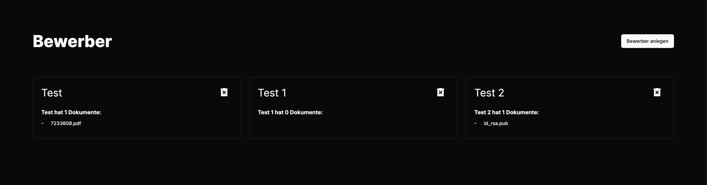
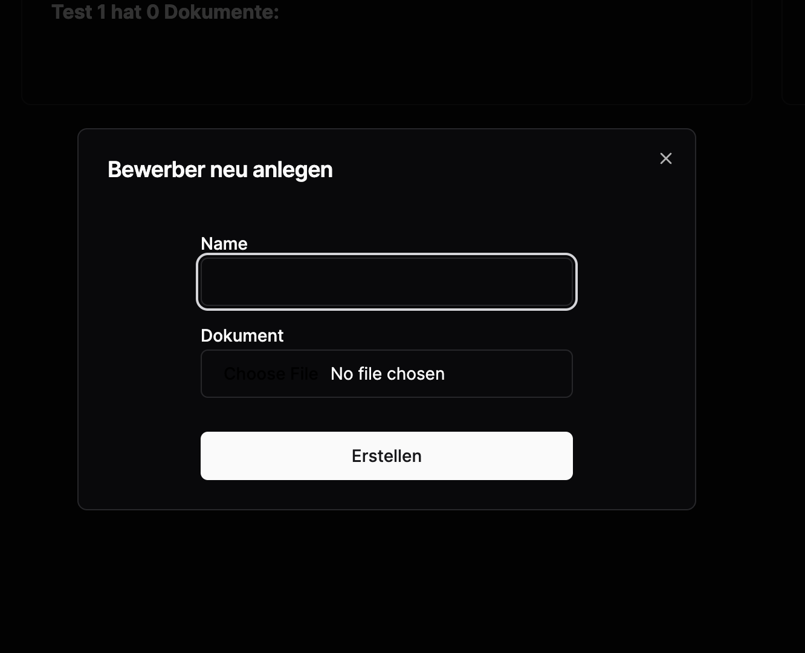

This is a [Next.js](https://nextjs.org/) project bootstrapped with [`create-next-app`](https://github.com/vercel/next.js/tree/canary/packages/create-next-app).

## Getting Started

First, run the api server and then the development server:

```bash
npm run dev
# or
yarn dev
# or
pnpm dev
# or
bun dev
```

You need to set "API" enviorment variable to the api url

Learn more about the api at [Applicant-API](https://github.com/NitrinCloud/Applicant-API)


Technologies used: NextJS, Bun, Shadcn/ui, TailwindCSS


## Showcase

### Show



### Create

